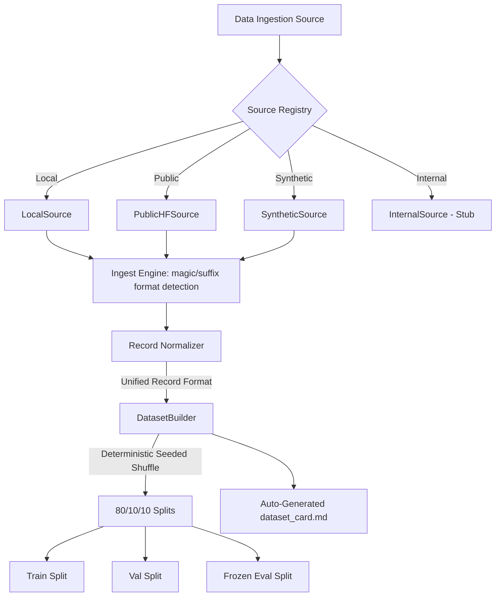
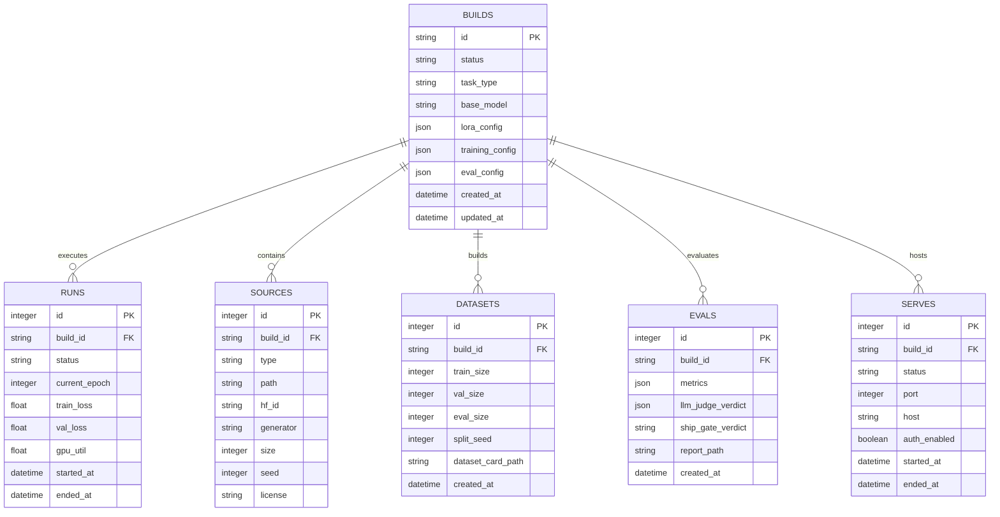
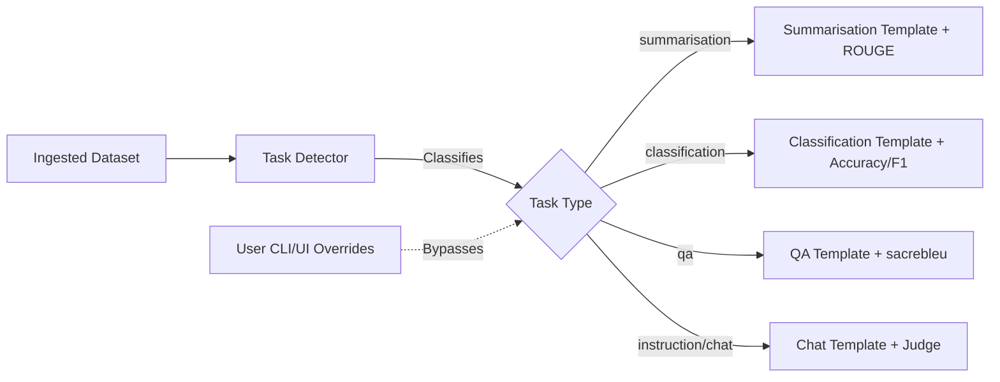

# SLMForge: Milestones 1 & 2 Progress Report

## 1. Executive Summary
**SLMForge** is a plug-and-play Small Language Model (SLM) builder designed for developers and operators. It simplifies the process of training, evaluating, and serving small language models. Point SLMForge at a folder of data via the command-line interface (CLI) or through its localhost React web application, and the system automatically orchestrates a complete lifecycle: ingestion, task auto-detection, fine-tuning (LoRA/QLoRA), evaluation (including LLM-as-judge and ship-gate checks), and local OpenAI-compatible endpoint serving (via vLLM with hot-swappable multi-LoRA adapters). The core project is engineered with strict data protection guidelines, ensuring internal data never leaks into public repositories while enabling stubs for future internal deployment upgrades.

---

## 2. Project Overview and Objectives
Built by a 5-student pod at the **Newton School of Technology (NST)** as part of the **Summer Profile Building Drive 2026**, the primary objective of SLMForge is to democratize domain-specific SLM creation. Historically, fine-tuning and deploying small language models required extensive boilerplate code, complex environment configurations, and deep expertise in model parameters. SLMForge bridges this gap by offering:
*   **Plug-and-Play Orchestration:** A single command (`slmforge build`) or a single click in the browser UI runs the entire data-to-endpoint pipeline.
*   **Dual Surfaces, Unified Engine:** Terminal-based CLI (`Typer` + `rich`) and web app (`React` + `Vite` + `TypeScript`) interfaces powered by a shared FastAPI and SQLite backend.
*   **Resource Efficiency:** Out-of-the-box support for LoRA/QLoRA training on consumer-grade and shared GPU hardware, including memory and time estimators.
*   **Safe Data Boundaries:** Architectural patterns, strict regex filters, and pre-commit hooks that keep proprietary internal data secure while supporting public dataset caching and synthetic data generation.

---

## 3. Work Completed So Far

### Milestone 1: Scaffold + Engine API Contract
The goal of Milestone 1 was to set up a robust development environment, establish state tracking, draft and lock the API contract, and expose the communication backbone between the UI/CLI and the engine.
*   **Repo Scaffolding & CI:** Initialized directory layouts, configured GitHub Actions CI workflow, created `Dockerfile` and `docker-compose.yml` for Redis queue/websocket pub-sub setup, and configured `.pre-commit-config.yaml` to check for ASCII violations and internal path leaks.
*   **Database Schema Design:** Designed and implemented a SQLite-backed database using SQLAlchemy models and managed schemas with Alembic migrations. The database features six core tables: `builds`, `runs`, `sources`, `datasets`, `evals`, and `serves`.
*   **FastAPI Skeleton:** Set up the server skeleton containing endpoints `/health`, `POST /builds` (with payload validation via Pydantic), `GET /builds`, and a WebSocket endpoint `WS /builds/{build_id}/stream` designed to emit lifecycle progress events.
*   **Engine API Contract Lock:** Formulated and committed the official API specification in [ENGINE_API.md](file:///Users/yogesh/Documents/ai-summer/slmforge_1/docs/ENGINE_API.md), establishing the JSON structures for builds, on-disk directory layouts, and progress stream events.

### Milestone 2: Data Layer + Source Adapters
Milestone 2 focused on ingestion, multi-format parsing, deterministic dataset creation, and strict source validation.
*   **Source Adapter ABC & Registry:** Built the extensible `Source` Abstract Base Class and a central registration mechanism in [registry.py](file:///Users/yogesh/Documents/ai-summer/slmforge_1/src/slmforge/data/sources/registry.py). It registers four concrete adapters:
    1.  `SyntheticSource`: Generates mock dataset records with configurable sizes and seeds.
    2.  `PublicHFSource`: Prefetches and wraps public Hugging Face datasets.
    3.  `LocalSource`: Directs file ingestion from the local filesystem.
    4.  `InternalSource` (Stub): A secure placeholder reserved for future internal data adapters, raising a clean `NotImplementedError` in public environments.
*   **Multi-Format Ingest Engine:** Developed the ingestion layer in [ingest.py](file:///Users/yogesh/Documents/ai-summer/slmforge_1/src/slmforge/data/ingest.py). It automatically detects file formats (using `python-magic` MIME detection and extension fallback) and streams records from JSONL, CSV, Parquet, and text file directories into a unified record format.
*   **Dataset Builder:** Implemented `DatasetBuilder` in [builder.py](file:///Users/yogesh/Documents/ai-summer/slmforge_1/src/slmforge/data/builder.py) to perform seeded, deterministic 80/10/10 splits (Train/Val/Eval), ensuring that the evaluation partition remains frozen and isolated to prevent data leaks. It also automatically outputs a standard `dataset_card.md` using [card.py](file:///Users/yogesh/Documents/ai-summer/slmforge_1/src/slmforge/data/card.py).
*   **Source Guard & Protection:** Designed `source_guard.py` to raise errors if builds contain unregistered source types or paths containing blocked patterns (`_internal/`, `internal/`, `nst_data/`). Integrated this guard as a secondary safety net in the CI workflow grep checks.
*   **Public Prefetch Utility:** Created [prefetch.py](file:///Users/yogesh/Documents/ai-summer/slmforge_1/src/slmforge/data/prefetch.py) and wired it to the CLI `slmforge data prefetch <dataset_id>` subcommand, caching public Hugging Face datasets locally to eliminate redundant network fetches during build runs.

---

## 4. Current Architecture and Design

### Directory Structure
```text
slmforge/
├── alembic.ini                  # Migration settings
├── pyproject.toml               # Python project configuration & dependencies
├── src/
│   └── slmforge/
│       ├── api/                 # FastAPI routers, database sessions, and schemas
│       │   ├── db.py
│       │   ├── main.py
│       │   ├── schemas.py
│       │   └── routes/
│       │       └── builds.py
│       ├── cli/                 # Typer-based CLI endpoints
│       │   └── main.py
│       ├── data/                # Ingest, prefetch, builders, cards, and guards
│       │   ├── builder.py
│       │   ├── card.py
│       │   ├── ingest.py
│       │   ├── prefetch.py
│       │   ├── preview.py
│       │   ├── source_guard.py
│       │   └── sources/         # Extensible source adapters
│       │       ├── base.py
│       │       ├── internal.py
│       │       ├── local.py
│       │       ├── public.py
│       │       ├── registry.py
│       │       └── synthetic.py
│       └── engine/              # Engine orchestration and SQLAlchemy schema
│           └── state.py
└── docs/
    └── ENGINE_API.md            # Documented API specifications
```

### Ingestion & Dataset Splits Workflow
The diagram below details the data flow through our source registry, ingest logic, and dataset builder:



### Database Schema (ER Diagram)
The current SQLite-backed SQLAlchemy schema is modeled as follows:



### Unified Record Format
All ingest adapters normalize target source structures into a standard dictionary representation defined in [base.py](file:///Users/yogesh/Documents/ai-summer/slmforge_1/src/slmforge/data/sources/base.py):
```python
class Record(TypedDict):
    id: str                  # Unique record reference
    text: str                # Target model input text
    metadata: Dict[str, Any] # Extracted context (source, size, metrics)
```

---

## 5. Challenges Faced and How They Were Addressed

### 1. Ruff Import Sorting & Formatting Clashes
*   **Challenge:** As multiple contributors pushed code, the CI pipeline frequently failed formatting guidelines due to import block differences and styling drift.
*   **Resolution:** Configured `pyproject.toml` with strict `ruff` settings, including `lines-between-types = 1` for `isort`. The team enforced local pre-commit hooks (`pre-commit install`) that automatically run `ruff check --fix` and `black` on every local commit.

### 2. CI Pipeline Failures with Native Libraries
*   **Challenge:** Ingestion file-type detection relies on `python-magic`, which has external dependencies on the system library `libmagic`. In clean CI runner environments, importing this library threw load-errors, failing initial builds.
*   **Resolution:** Modified [ingest.py](file:///Users/yogesh/Documents/ai-summer/slmforge_1/src/slmforge/data/ingest.py) to wrap `magic` imports in a try-except block. Added fallback rules relying on file suffixes and structural analysis (e.g. attempting to parse lines as JSON) so ingestion continues cleanly even if `libmagic` is missing.

### 3. Internal-Data Scan False Positives in CI
*   **Challenge:** The security script checking the repository for leaks of proprietary internal paths flagged configuration files like `.github/workflows/ci.yml` or documentation files simply because they referenced the security rules or contained validation regex patterns.
*   **Resolution:** Refined the CI workflow configurations to systematically exclude test configurations, workflow definitions, and `docs/` paths from the internal-data scan script, preventing build failures on harmless references.

### 4. Package Import Tracking Errors
*   **Challenge:** Contributors experienced module import failures (`ModuleNotFoundError` for `slmforge.data`) in CI and unit tests because directory initializers were missing or package setup definitions in `pyproject.toml` were not fully tracked.
*   **Resolution:** Added missing `__init__.py` initializers across all code directories and explicitly configured `tool.setuptools.packages.find` to target `src/`, resolving path resolution errors for local developer checkouts.

---

## 6. Next Milestones and Roadmap

The next phase of the project focuses exclusively on **Milestone 3: Task Type System**.

### Milestone 3 Overview
The goal of Milestone 3 is to implement an intelligent task detection layer that classifies ingestion datasets, chooses task-specific templates, pairs them with correct evaluation metrics, and enables user overrides.



### Specific Tasks & Deliverables
1.  **Task Detector implementation (Issue 10):**
    *   Develop a heuristic rule engine combined with a lightweight classifier in `src/slmforge/task/detector.py`. It will evaluate dataset schemas and content patterns to return task type, confidence score, and alternate recommendations.
2.  **Per-Task Templates (Issue 11):**
    *   Create rendering templates in `src/slmforge/task/templates.py`. This system transforms raw records into instruction/response prompts matching structural formats for models like Phi-3 and Llama 3.1.
3.  **Per-Task Metric Selector (Issue 12):**
    *   Write mapping utilities in `src/slmforge/task/metrics.py` matching task types to specific evaluation metrics (Accuracy/F1, ROUGE-L, sacrebleu).
4.  **Override Paths in CLI & UI (Issue 13):**
    *   Expose CLI parameters (`--task`, `--base`) and Web UI selection dropdowns allowing developers to bypass detector recommendations.
5.  **Task Detector Regression Suite (Issue 14):**
    *   Set up a benchmark suite of >= 30 labelled dataset samples in `tests/fixtures/task_detection/` to enforce a minimum accuracy threshold of 85% in CI, preventing regression.
